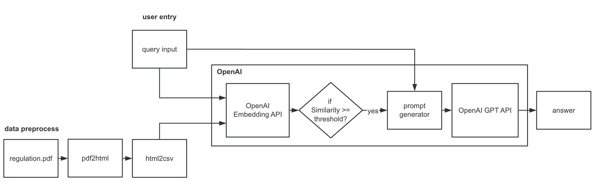
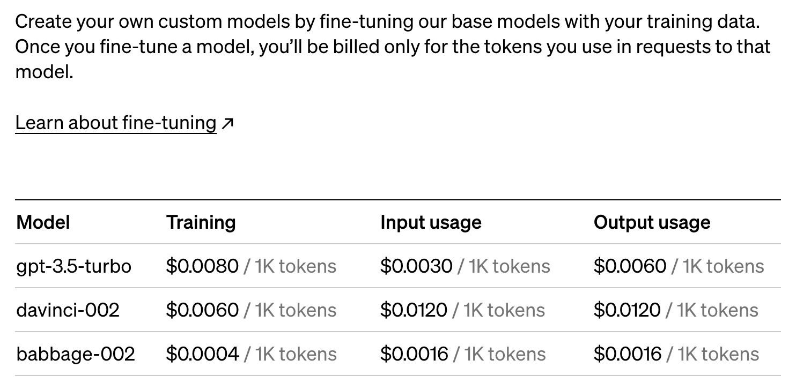
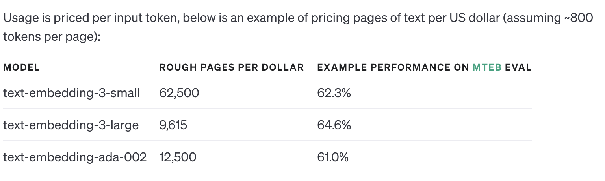

# Chatbot Proposal
To train a chatbot, there are two factors that we need to consider:

1. Tone of the chatbot: This refers to the way it responds to users. We can use the OpenAI fine-tune API to train the model with a dataset.

2. Knowledge of the chatbot: In order to provide GPT with a knowledge base of a certain area, we can use the OpenAI embedding API to embed a large knowledge set. This will allow us to retrieve knowledge with high similarity to the query.

## fine-tuning
If you want to fine-tuning a gpt to learn the style, tone or format of the responses, you need to prepare a training dataset for the gpt. I have trained an AI writing assistant by fine-tuning the GPT3.0 model with essays, enabling it to polish students' essays in a specific tone.Take the project I completed as an example, it usually takes following steps:

1. extract the data from the materials: In that project, the materials were many Word documents which contain many model essays. To extract the essays in the documents, I use python to extract the essays based on their font sizes and write them in to a file.
2. prepare the training data: The training dataset need a set of training cases of answering questions. Therefore, I need to design a training set for fine-tuning. I used gpt4 to summarize the content of the essays as the input and the model essays as the output to construct the training dataset.
3. use openAI API to fine-tune model.
   
Through the above 3 steps, we can get a fine-tuned gpt bot which learns how to answer the questions in certain tone.

## embedding
If we want enable GPT to answer questions using a library of reference text, embedding is a good choice. When we have a large knowledge database and we want to check the answer of only small part of the knowledge base, embedding search can help us locating the knowledge quickly.

For the embedding-gpt model, I have a complete solution of a regulation-searching-assistant project I recently worked on.

Here is the outline of the system:

The whole model contains following steps:
1. construct the dataset.
2. embedding the dataset.
3. design the prompt.
4. optimize the model with test cases.

## Cost
For fine-tuning, it depends on the tokens of training set.You can refer to this picture:

For embedding, the cost depends on how many tokens are there in your knowledge base. It is much cheaper than fine-tuning. You can refer to this picture:

All the price of api can be checked on https://openai.com/pricing#language-models

   
You can discuss further with me for the project details. Looking forward to your reply!
