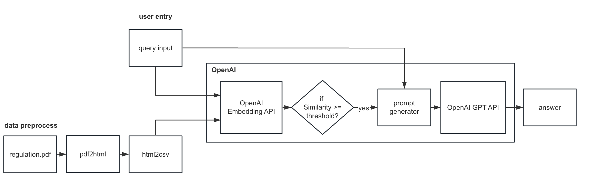

# Proposal
The whole development of project can be divided in to 2 parts: the QA model and the webpage. I will illustrate them respectively:

## QA model
Requirement: build a question-answering model based on the standard knowledge. 

To fulfill this requirement, I will use openAI embedding API to search the top n relevant standards with the query from users. It will provide the most n relevant standards to the user.

 If you want the answer to be more intelligible, I can train the gpt to provide a clear answer based on the relevant standards.

 For the whole structure of the model, I have designed a similar project before:

 ## webpage
 Requirement: clients can use this page to ask questions about standards.

 The basic function is the interaction between user and the model. But we can explore more like: providing some frequent queries for the users; let user select the certain standard database to narrow the search scope etc.

 The appearance of the webpage will imitate the style of chatgpt, if you have more requirements, we can discuss further about the design of the webpage.

 ## Questions need to be confirmed:
1. the format of the knowledge I need to search with(pdf/ csv/other formats?). You can send me sample file or snapshot.
2. the main function of the app. Besides the function of searching the knowledge, do you have more requirements of the app?(like some frequent queries provided for the users). We can discuss and explore more functions later.
3. The form of response. If only use embedding to search the relevant standards, it will directly list the top n relevant standards to the user. If you want the answer to be more intelligible, I can train the gpt to provide a clear answer based on the relevant standards.
